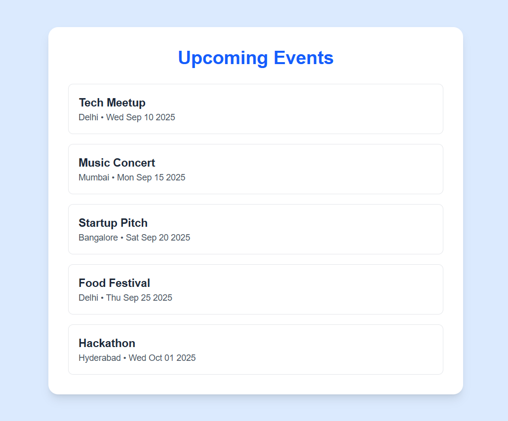
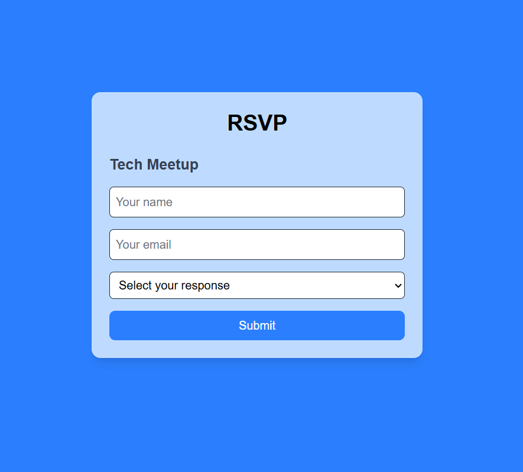
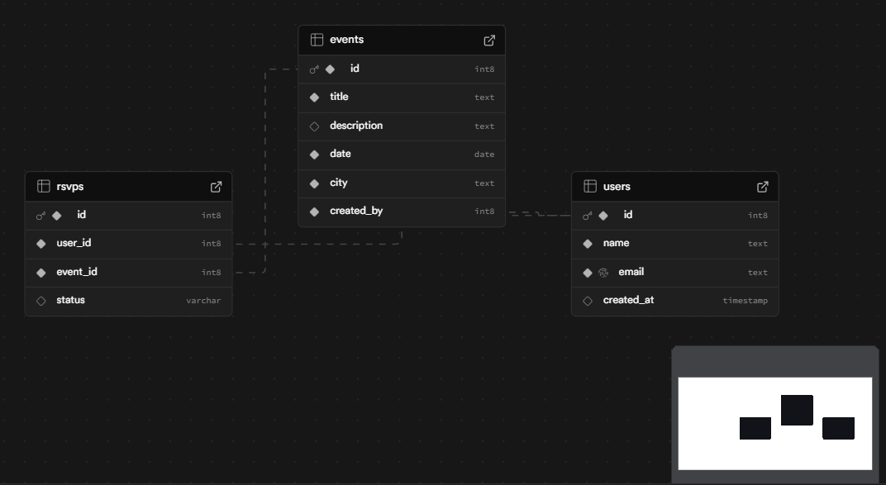

# Supabase Events RSVP 🎟️

A simple event RSVP platform built with **Next.js** + **Supabase**, as part of the Database Management assignment for **PixaBeam**.  

Users can:  
✅ View a list of upcoming events  
✅ RSVP to events with a status (**Yes / No / Maybe**)  

---

## 🚀 Live Demo  
🔗 [Deployed on Vercel](https://supabase-events-rsvp.vercel.app)  

(Add your actual Vercel link above 👆)  

---

## 🛠️ Tech Stack  
- **Frontend**: [Next.js](https://nextjs.org/) (React + TypeScript)  
- **Backend/Database**: [Supabase](https://supabase.com/) (Postgres + Auth)  
- **Styling**: [Tailwind CSS](https://tailwindcss.com/)  
- **Deployment**: [Vercel](https://vercel.com/)  

---

## 📂 Database Schema  

### Users  
- `id` (PK)  
- `name`  
- `email` (unique)  
- `created_at`  

### Events  
- `id` (PK)  
- `title`  
- `description`  
- `date`  
- `city`  
- `created_by` → FK (`Users.id`)  

### RSVPs  
- `id` (PK)  
- `user_id` → FK (`Users.id`)  
- `event_id` → FK (`Events.id`)  
- `status` (enum: Yes / No / Maybe)  

✅ Referential integrity: deleting a user also deletes their RSVPs.  

---

## 📸 Project Screenshots

### 1. Events Page

### 2. RSVP Page

### 3. ER Diagram

  
